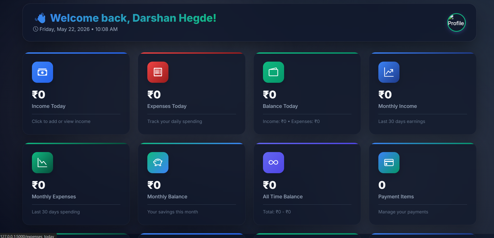
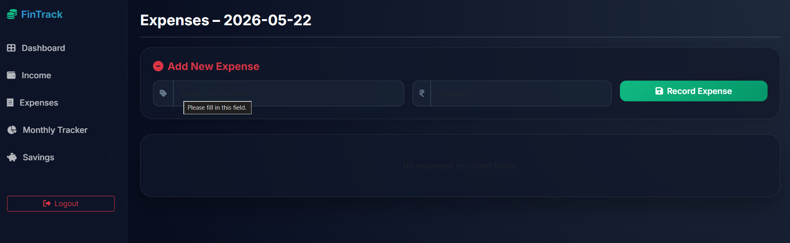
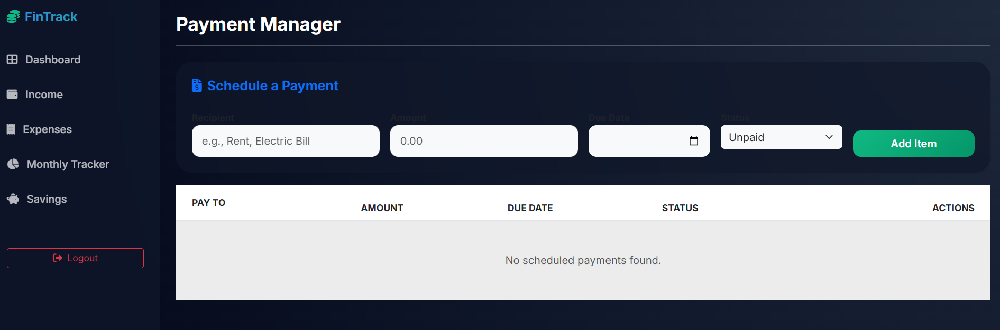
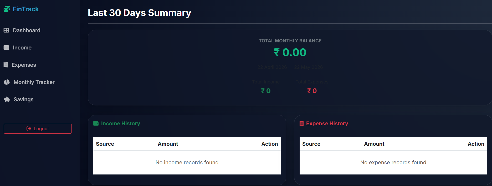

# 💰 FinTrack - Personal Expense Tracker

FinTrack is a modern Personal Finance & Expense Tracking Web Application built using Flask, SQLite, HTML, CSS, Bootstrap, and JavaScript.

The application helps users manage:

- Daily Expenses
- Income Tracking
- Savings Goals
- Monthly Expense Analysis
- Payment Tracking
- Financial Reports
- Budget Management

---

# 📸 Project Preview

## login


---

## Dashboard



---

## Income Tracking


---

## Expense Tracking



---

## Payments Page



---

## Savings Tracker



---

# 🚀 Features

## 🔐 User Authentication
- User Signup
- Login System
- Session Management
- Secure User Dashboard

---

## 💵 Income Management
- Add Daily Income
- Monthly Income Reports
- Edit/Delete Income
- Income History

---

## 💸 Expense Management
- Add Expenses
- Track Daily Spending
- Expense Categories
- Expense History
- Edit/Delete Expenses

---

## 📊 Dashboard Analytics
- Total Income
- Total Expenses
- Remaining Balance
- Budget Tracking
- Savings Goals
- Smart Suggestions

---

## 💳 Payment Tracking
- Add Payments
- Paid / Unpaid Status
- Payment History
- Payment Editing

---

## 🏦 Savings Management
- Savings Tracking
- Repayment Tracking
- Financial Planning

---

# 🛠 Technologies Used

## Frontend
- HTML5
- CSS3
- Bootstrap 5
- JavaScript

## Backend
- Python Flask

## Database
- SQLite
- SQLAlchemy ORM

---

# 📂 Project Structure

```bash
FinTrack/
│
├── static/
│   ├── css/
│   ├── js/
│   └── images/
│
├── templates/
│   ├── login.html
│   ├── signup.html
│   ├── dashboard.html
│   ├── payments.html
│   ├── track.html
│   └── more templates...
│
├── app.py
├── requirements.txt
└── README.md
```

---

# ⚙️ Installation

## 1️⃣ Clone Repository

```bash
git clone https://github.com/darshanvh/FinTrack.git
```

---

## 2️⃣ Move into Folder

```bash
cd FinTrack
```

---

## 3️⃣ Install Requirements

```bash
pip install -r requirements.txt
```

---

## 4️⃣ Run Application

```bash
python app.py
```

---

# 🌐 Open in Browser

```bash
http://127.0.0.1:5000
```

---

# ✨ Future Improvements

- AI Expense Prediction
- Export Reports PDF
- Dark Mode
- Mobile App Version
- Email Notifications
- Cloud Database Support

---

# 👨‍💻 Developer

## Darshan Hegde

MCA Student | Full Stack Developer | Python Flask Developer

---

# 📧 Contact

Email: darshanhegdehegde@gmail.com

GitHub: https://github.com/darshanvh

---

# ⭐ Support

If you like this project, give it a ⭐ on GitHub.
